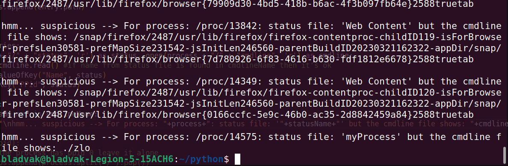

## ABOUT

The simplest antivirus ever.
This is a very loose approach to an idea that came to my mind after reading [Understanding Linux Malware](https://ieeexplore.ieee.org/document/8418602).
Specifically, this section:

 >... shows that over 50% of the samples
>assumed different names once in memory, and also reports
>the top benign application that are impersonated. In total
>we counted more than 4K samples invoking the system call
>prctl with request PR_SET_NAME, or simply modifying
>the first command line argument of the program (the program
>name). Out of those, 11% adopted names taken from common
>utilities. For example, samples belonging to the Gafgyt family
>often disguise as sshd or telnetd. It is also interesting to
>discuss the difference between the two renaming techniques.
>The first (based on the prctl call) results in a different
>process name listed in /proc/<PID>/status (and used by
>tools like pstree), while the second modifies the information
>reported in /proc/<PID>/cmdline (used by ps). Quite
>strangely, **none of the malware in our dataset combined the
>two techniques (and therefore could all be easily detected by
>looking for name inconsistencies)**.
>The remaining 88% of the samples either adopted an empty
>name, a name of a fictitious (but not existing) file, or a random-
>looking name often seeded by a combination of the current
>time and the process PID. This last behavior, implemented by
>some of the Mirai samples, results in the fact that the malicious
>process assumes a different name at every execution.

This simple script checks whether the value of name in /proc/PID/status is contained in the string from /proc/PID/cmdline. I know - exciting stuff.
Lots of the cmdline files are empty for os processes like kthread and similiar, so the script doesn't take them into cosideration (otherwise, it would produce a looong list). Furthermore, some of the processes like tabs of firefox do have a non-empty cmdline file, but the names don't match, so it lists them as well. 

